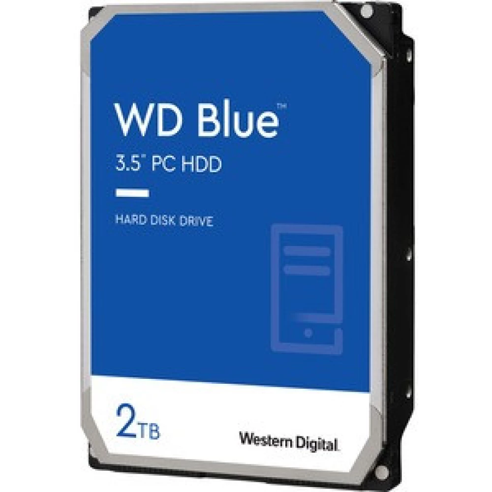

<html>
    <meta charset="UTF-8">
<head>

</head>

</html>
<body>
     
    
    <table>
    <tr>
        <td></td>
        <td>Főoldal</td>
        <td></td>
        <td>Kapcsolat</td>
        <td></td>
        <td>Információk,</td>
        <td>GYIK</td>
        <td></td>
        <td></td>
        <td></td>
        <td></td>
        <td></td>
        <td></td>
        <td></td>
        <td>Kosár</td>
        <td></td>
        <td>Bejelentkezés</td>
    </tr>
    </table>
    
    
    
    
Gembird HDD külső ház

    
    
Raktáron: IGEN  
    Garancia: 12 hónap

    
    
Átvételi lehetőségek

    
    

    Duna Plaza 
    Csomagpont 
    PACKETA 
    GLS 
    

    
    

    2022-09-28 
    2022-09-29 
    2022-09-29 
    2022-09-29 
    

    
Tulajdonságok

    

        <ul>
        <li><b>Alap szín: </b> Fekete</li>
        <li><b>Anyag: </b> Alumínium</li>
        <li><b>Backup funkció: </b> Nem</li>
        <li><b>Belső csatlakozó: </b> SATA</li>
        <li><b>Chipset: </b> Nem</li>
        <li><b>Csatlakozó A: </b> 1x USB 3.0 mini anya</li>
        <li><b>Csatlakozó B: </b> 1x SATA apa</li>
        <li><b>Csomagolás: </b> Doboz</li>
    </us>
    

    

        <ul>
        <li><b>HDD helyek száma: </b> 1</li>
        <li><b>HDD méret: </b> 2,5"</li>
        <li><b>Kártyaolvasó: </b> Nem</li>
        <li><b>Külső csatlakozó: </b> USB 3.0</li>
        <li><b>Támogatott HDD kapacitás (GB): </b> Nincs megadva</li>
        <li><b>Típus: </b> Merevlemez ház</li>
        <li><b>Zárható: </b> Igen</li>
        </ul>
    

    
 Így is ismerheti:  
        <i>"Gembird 2.5" SATA USB3.0 külső ház fekete aluminium" </i>
    

    
    
    
    
Számítógép alkatrészek > Merevlemezek, NAS > Beépítőkeretek, Házak, Dokkolók
    

    
    
    
    
 <b>3090 Ft</b>

    
    
<b>Ajánló</b>

    
4TB Seagate 3.5" Barracuda  
        SATAIII winchester 
        (ST4000DM004)
    

    

    

    
ORICO 2189U3-BK-BP külső 
        merevlemez ház
    

    

    
2TB WD 3.5" Blue SATAIII 
        winchester (WD20EZBX)

    

    

    <a class="segitseg" href="erdekesseg.html">Érdekes tudnivalók

    </a>
    
</body>